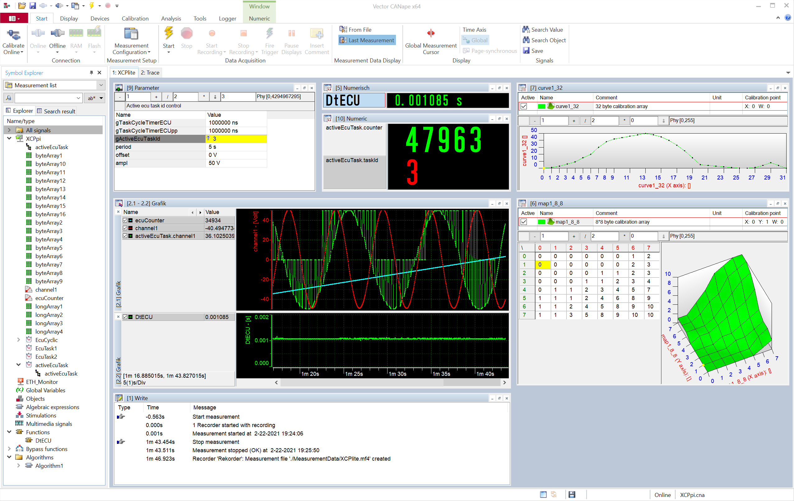

# XCPlite V5

Copyright 2021 Vector Informatik GmbH

Lightweight implementation of the ASAM XCP Protocol Layer V1.4.

Supports Linux 32/64 Bit and Windows 32/64 Bit.
Posix and Windows Sockets or Vector VN5xxx automotive Ethernet devices.
100-Base-T1 or 1000-Base-T1 BroadrReach, XL-API V3 network based access.

List of restrictions compared to Vectors free xcpBasic and commercial xcpProf in source file xcpLite.c.

Supports only XCP on Ethernet, TCP or UDP
Thread safe, minimal thread lock and zero copy data acquisition.
C and C++ target support.

Achieves up to 100 MByte/s throughput on a Raspberry Pi 4 (jumbo frames enabled).

Quick start with no A2L (ASAP2 ECU description) required.
An A2L with reduced featureset is generated through code instrumentation during runtime on target system
and automatically uploaded by XCP).

C and C++ measurement demo C_DEMO / CPP_Demo.
Calibrate and measure global variables and dynamic instances of classes.


## Code instrumentation for measurement:

Only simple code instrumentation needed for event triggering and data copy, event definition and data object definition.

Example:

### Definition:
```
  double channel1;
```

### Initialisation and A2L info generation:

```
  channel1 = 0;

  A2lCreateEvent("ECU"); // Create a new event with name "ECU""
  A2lSetEvent("ECU"); // Set event "ECU" to be associated to following measurement definitions
  A2lCreatePhysMeasurement(channel1, 2.0, 1.0, "Volt", "Demo floating point signal"); // Create a new measurement signal "channel1" with linear conversion rule (factor,offset) and unit "Volt"
```


### Measurement data acquisition event:

```
  channel1 += 0.6;
  XcpEvent(1); // Trigger event, timestamp and copy measurement data
```




## Configuration options:

All settings and parameters for the XCP protocol and transport layer are located in xcp_cfg.h and xcptl_cfg.h.
Compile options for the XCPlite demos are located in main_cfg.h:

## Notes:

- Specify the IP addr on the command line (-bind), when you have multiple Ethernet adapters. 
  Otherwise the IP address of the first Ethernet adapter found, will be written to A2L file. 

- If A2L generation and upload is disabled, make sure CANape (or any other tool) is using an up to date A2L file.
  You may enable EPK check, to make sure the A2L description matches the ECU software.

- If A2L upload is enabled, you may need to set the IP address manually once.
  When connect is refused in CANape, press the flashing update icon in the statusbar 

- For CANape automatic A2L address update, use Linker Map Type ELF extended for Linux a.out format or PDB for Microsoft .exe

- 64 bit builds needs all objects located within one 4 GByte data segment. Note that XCP addresses are 32 Bit plus 8 Bit extension. 
  The conversion methods from pointer to A2l/XCP address and vice versa, are in xcpAppl.c and maybe changed for specific needs. 
  xcpLite.c does not make assumptions on addresses. The only exception is during measurement, where XcpEvent creates pointers by adding the XCP/A2L address to ApplXcpGetBaseAddr(). 
  To save space, the 32 Bit addresses, not 64 Bit pointers are stored in the DAQ lists.
  During measurement setup, ApplXcpGetPointer is called once to check for validity of the XCP/A2L address conversion. 
  
- Multicast time synchronisation (GET_DAQ_CLOCK_MULTICAST) is enabled in CANape by default
  When measurment does not start, it is most probably a problem with multicast reception
  It provides no benefit with single clients or with PTP time synchronized clients and therefore just unnessesary effort
  Turn it off in device/protocol/event/TIME_CORRELATION_GETDAQCLOCK, change from "multicast" to "extended response"

- Enable XL-API on command line: C_Demo -v3 -addr 172.31.31.1 -port 5555


## Version History

Version 5:
- C and C++ Demo code seperated
- UDP or TCP support for sockets, UDP support for XL-API (Vector VN56xx Ethernet Interfaces)
- XL-API DLLs not included, download from Vector Website required
- Refactoring to reduce and clarify dependencies, platform.c and xcpAppl.c
- Improved cmake support
- XCP server implementation as a C++ class 
- Improved runtime type generation for A2L generator when compiled as C++

Version 4:

- Refactoring to minimize dependencies
- All dependencies to UDP socket library in platform.h/.c
- Support for Vector XL-API removed


## Build

### Linux 

$ sudo apt-get install cmake g++

#### Build

Edit C_Demo/CMakeLists.txt: set(WINDOWS FALSE)

```
$ cd XCPlite
$ mkdir build_C_Demo

$ cmake -DCMAKE_BUILD_TYPE=Release -S C_Demo -B build_C_Demo
$ cd build_C_Demo
$ make

```

### macOS 

$ brew install cmake gcc 

#### Build

Edit C_Demo/CMakeLists.txt: set(WINDOWS FALSE)

```
$ cd XCPlite
$ mkdir build_C_Demo

$ cmake -DCMAKE_BUILD_TYPE=Release -S C_Demo -B build_C_Demo
$ cd build_C_Demo
$ make

```

### Windows x86_64

Use the Visual Studio 19 projects included in the repo or build projects with CMake.

#### Build Visual Studio project and solution
```
Start cmake-gui
Choose your build options in the GUI
Start the generated VS solution
```

#### Build on Windows command line

For the CMake setup, prepare your command line environment.
Set compiler to Microsoft x64 cl.exe and make sure the system finds cmake.exe and ninja.exe.
You can also use the Windows clang compiler.

```
> call "C:\Program Files (x86)\Microsoft Visual Studio 15.0\VC\Auxiliary\Build\vcvars64.bat"
> set PATH=C:\Tools\ninja;%PATH%
> set PATH=C:\Tools\cmake_3.17.2.0\bin;%PATH%
> cd XCPlite
> mkdir build_release
> cd build_release
> cmake -GNinja -DCMAKE_BUILD_TYPE=Release ../C_Demo
> ninja
```

