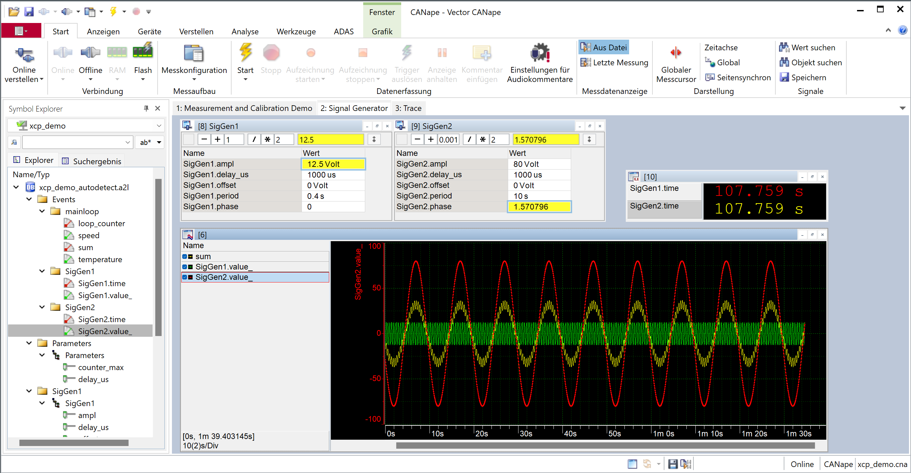

# XCPlite

## Introduction to XCP

XCP is a measurement and parameter tuning (calibration) protocol commonly used in the automotive industry. It is an ASAM standard.  

It provides real time signal oriented data acquisition (measurement, logging) and tuning of parameter constants (calibration) in a target micro controller system (ECU), to help observing and optimizing cyber physical control algorithms in real time.  
  
Timestamped events, measurement variables and parameter constants are described by an ASAM-A2L description file, another associated ASAM standard. A2L is a human readable ASCII format.  
In a micro controller system programmed in C or C++, measurement data items are directly accessed in their original memory locations. This concept has minimum impact on the target system in terms of memory consumption, runtime and needs minimum code instrumentation. The A2l is a kind of annotated ELF Linker-Address-Map, with meta information on data instances and data types (MC specific types - lookup-tables, axis scaling, physical limits and units, conversion rules, ...).  

In a Microprocessor system developed in a system programming language like C, C++ or Rust, this concept is still useful and efficient. Measurement signals and calibration parameters usually have a static lifetime and a defined memory layout, but no predefined memory location and are not limited to static storage classes. Data acquisition and modification is achieved by appropriate code instrumentation for measurement and wrapper types for groups of calibration parameters.

From a software developer perspective, XCP may be considered to be a high-frequency application level tracing solution, using statically instrumented trace points with configurable associated data. Tracing can be started, stopped and reconfigured during runtime. What is not configured, does not consume bandwidth, memory and other resources. The acquired context data is always consistent and trace events are precisely time stamped. Data types and instances of available context data items are defined as code or obtained by a XCP tool from ELF/DWARF debug information. Data instances may be in global, local, thread local and heap storage locations. In addition to that, XCP provides the capability to modify application variables and state in a thread safe and consistent way.  

The ASAM-XCP standard defines a protocol and a transport layer. There are transport layers for all common communication busses used in the automotive industry, such as CAN, CAN-FD, FLEXRAY, SPI and Ethernet.  

New to XCP?  
Checkout the Vector XCP Book:  
<https://www.vector.com/int/en/know-how/protocols/xcp-measurement-and-calibration-protocol/xcp-book#>  

Visit the Virtual VectorAcademy for an E-Learning on XCP:  
<https://elearning.vector.com/>  

## XCPlite Overview

XCPlite is an implementation of XCP for Microprocessors in pure C, optimized for the XCP on Ethernet Transport Layer for TCP or UDP with jumbo frames.  
It is optimized for 64 Bit platforms with POSIX based Operating Systems, but also runs on 32 Bit platforms and on Windows with some restrictions.  
The A2L measurement and calibration object database can be generated during runtime and uploaded by the XCP client tool on connect.  

XCPlite is provided to test and demonstrate calibration tools such as CANape or any other XCP client implementation.  
It may serve as a base for individually customized XCP on Ethernet implementations on Microprocessors.  
It implements and demonstrates some techniques how to deal with variables in dynamically allocated memory and how to do measurement and parameter tuning in multi-threaded applications.  

XCPlite is used as a C library by the implementation of XCP for Rust in:  
<https://github.com/vectorgrp/xcp-lite>  

### Whats new in XCPlite V0.9.3

Work in progress

- More flexible addressing mode configuration in xcp_cfg.h
- Absolute calibration segment addressing (OPTION_CAL_SEGMENTS_ABS in main_cfg.h)
- Signature of xcplib::CreateCalSeg changed, pointer to reference page page
- Automatic EPK segment is optional  (OPTION_CAL_SEGMENT_EPK in main_cfg.h)
- Support for more than one base address in relative address mode
- Optional async event with 1ms cycle time and prescaler support (OPTION_DAQ_ASYNC_EVENT in main_cfg.h)
- New experimental demo no_a2l_demo to demonstrate workflows without runtime A2L generation (using a XCPlite specific A2L creator, see README.MD of no_a2l_demo)
- Memory optimization for event/daq-list mapping
- Internal naming convention refactored to support A2L creation for dynamic objects from ELF/DWARF binaries  (gXcp, gA2l and __* are ignored by the A2L creator)
- Generated A2L file uses the project_no identifier to indicate the configured addressing schema (currently ACSDD or CASDD)
- Generate IF_DATA CANAPE_ADDRESS_UPDATE for memory segments
- Option to include or embed AML files
- Bugfixes

### Whats new in XCPlite V0.9.2

- Breaking changes to V6.  
- Lockless transmit queue. Works on x86-64 strong and ARM-64 weak memory model.  
- Measurement and read access to variables on stack.  
- Calibration segments for lock free and thread safe calibration parameter access, consistent calibration changes and page switches.  
- Supports multiple segments with working and reference page and independent page switching.  
- Refactored A2L generation macros.  
- Build as a library.  
- Used (as FFI library) for the rust xcp-lite version.  

### Features

- Supports XCP on TCP or UDP with jumbo frames.  
- Thread safe, minimal thread lock and single copy event driven, timestamped high performance and consistent data acquisition.  
- Runtime A2L database file generation and upload.  
- Prepared for PTP synchronized timestamps.  
- Supports calibration and measurement of structures.  
- User friendly code instrumentation to create calibration parameter segments, measurement variables and A2L metadata descriptions as code.  
- Measurement of global (static), local (stack) or heap variables and class instances.  
- Thread safe, lock-free and wait-free ECU access to calibration data.  
- Calibration page switching and consistent modification.  
- Calibration segment persistence.  

There are other implementations of XCP available:  
XCPbasic is a free implementation for smaller Microcontrollers (even 8Bit) and optimized for CAN as Transport-Layer.  
XCPprof is a commercial product in Vectors AUTOSAR MICROSAR and CANbedded product portfolio.  

### Compatibilty

The required C and and C++ language standards are C11 and C++20.  

Most of the examples require CANape 23 or later, because they use A2L TYPEDEFs and relative memory addressing.  

### Documentation

A description of the XCP instrumentation API is available in the doc folder.  

## Examples  

Examples are found in the examples folder.  

To get started, take a first look at C example hello_xcp and then at hello_xcp_cpp for C++.

### Example CANape projects

There is a CANape project for each example in a directory folder "examples/<ExampleName>/CANape".  
To load a project into CANape, select load project and navigate to the CANape.ini file in this folder.  
All CANape project examples are configured to upload the A2L file via XCP. The IP address of the XCP server is stored in the A2L file uploaded last time. If CANape can not connect, check that the correct IP address is configured in "Device Configuration/Devices/<DeviceName>/Protocol/Transport Layer".  

The examples should run with a CANape demo version, which can be downloaded from <https://www.vector.com/de/de/support-downloads/download-center>.
The demo installation must be explicitly enabled in the installer and has some limitations:  
It will store only the first seconds of measurement data and the number of measurement signals is limited.

Note: Some of the examples use display windows without title bars to make it look cleaner. This option can be turned of with "Options/Display/View/Display Headline".  

### Example Details

hello_xcp:  
  Demonstrates how to start the XCP on Ethernet server and use the runtime A2L generator.  
  Shows how to create a calibration parameter segment structure, register the parameters in the segment and access them safely.  
  Defines events for measurement of global and local (stack) variables.  
  Demonstrates the different addressing modes for measurement variables and calibration parameters.  
  Defines a function, registers local variables and function parameters and creates and triggers a measurement event in the function.  

hello_xcp_cpp:
  Demonstrates how to instrument a member function of a C++ class and how to register and access parameters in C++.  

no_a2l_demo:
  Demonstrates XCPlite without runtime A2L generation by using an A2L generation tool during the build process.  
  This variant is currently limited to measurement and modification of global variables.  

The other examples cover more advanced topics:  

- Safely share parameters among different threads.  
- Measure instances of complex types, such as structs, arrays, nested structs and arrays of structs by using typedefs.  
- Create complex parameters, like maps, curves and lookup tables with fixed or shared axis.  
- Measure thread local instances of variables, create event instances.  
- Create physical conversion rules and enumerations.  
- Create additional groups.  
- Use consistent atomic parameter modification.  
- Make parameter changes persistent (freeze).  
- Use the xcplib API to create context and span, measure durations.  

c_demo:  
  Shows more complex data objects (structs, arrays) and calibration objects (axis, maps and curves).  
  Measurement variables on stack and in global memory.  
  Consistent parameter changes and measurement.  
  Calibration page switching and EPK version check.  
  Note: If CANAPE_24 is defined in sig_gen.hpp, the lookup table is a nested typedef, it uses a THIS. references to its shared axis contained in the typedef.

struct_demo:  
  Shows how to define measurement variables in nested structs, multidimensional fields and arrays of structs

multi_thread_demo:  
  Shows measurement in multiple threads.  
  Create thread local instances of events and measurements.  
  Share a parameter segment among multiple threads.  
  Thread safe and consistent access to parameters.  
  Experimental code to demonstrate how to create context and spans using the XCP instrumentation API.  

cpp_demo:  
  Demonstrates the calibration parameter segment RAII wrapper.  
  Demonstrates measurement of member variables and stack variables in class instance member functions.  
  Shows how to create a class with a calibration parameter segment as a member variable.  

threadx_demo:
  Planned
  
bpf_demo:
  Experimental, work in progress.  
  Demonstrates tracing of process creations and selected syscalls.  
  


### Building a CANape project and configuration from scratch

How to create a new CANape project from scratch is described in the CANape help under "Creating a project and configuration (quick guide)".  

The easiest way to create a new CANape project for XCPlite is:  

- Create a new project in 'Backstage/Project/New'.  
- Drag&Drop the A2L file generated by XCPlite on the CANape desktop and step through the pop up dialog pages:  
    Select XCP, Ethernet and LocalPC:ETH to use the local PCs ethernet adapter.  
    All other settings may stay on default.  
- CANape should now be already connected.  
    If not, check the Ethernet settings in 'Device/DeviceConfiguration/Devices/MyDevice/Protocol/TransportLayer'.  
- To configure CANape for automatic upload of the A2L file, a few more setting have to be modified once in the new project:  
    In 'Device/DeviceConfiguration/Devices/MyDevice/Database', enable automatic detection of database content and select 'Check identifier and content'.

The automatic A2L upload then happens every time a new version of A2L file has been generated.  
Depending on the settings in XCPlite, this happens after the first run of a new software build, or each time the application is restarted.  
Of course, the A2L file may also be copied manually into the CANape project folder.  

### Build on Linux or macOS

Use the build script to build the library xcplib, example targets and get comprehensive output on issues:

```bash
./build.sh
```

Or build individual example targets:

```bash
cmake -DCMAKE_BUILD_TYPE=Debug -S . -B build  
make --directory ./build hello_xcp
```

### Build on Windows

It is possible to build for Windows with the Microsoft Visual Studio compiler, but there are some limitations and performance penalties under Windows.  
XCPlite is optimized for Posix based systems.  
On Windows, atomic operations are emulated and the transmit queue always uses a mutex on the producer side.  

```bash
cmake -DCMAKE_BUILD_TYPE=Debug -S . -B build-msvc
cmake --build build-msvc --target hello_xcp
build-msvc/debug/hello_xcp.exe
```

To create a Visual Studio solution:  

```bash
./build.bat
```

## Appendix

### Trouble shooting compilation issues

First of all, note that XCPlite requires C11 (and C++17 for C++ support).
A possible problematic requirement is that the 64-bit lockless transmit queue implementation requires atomic_uint_least4.  
This may cause problems on some platforms when using the clang compiler.  
Prefer gcc for better compatibility.  
If this is not an option, the mutex based 32-bit queue may be used instead.  

```bash

# Test with system default
cmake -B build -S . && cmake --build build

# Test with clang
cmake -B build-clang -S . -DUSE_CLANG=ON && cmake --build build-clang

# Test with GCC  
cmake -B build-gcc -S . -DUSE_GCC=ON && cmake --build build-gcc

```

There is a script 'build.sh' to automate the build process and to check which of the targets have build issues.  
If there are failures, copy & paste the complete output and provide it.  

```bash
./build.sh
```

'build.sh' has command line parameters to select a release or debug build and force the compiler to be used.  

```bash
./build.sh --help
```

Default is the system default compiler and debug build.  

On failure try to force gcc:  

```bash
./build.sh gcc
```

If still fails and if type_detection_test_c builds ok, run it.  

```bash
./build/type_detection_test_c.out
```

Copy & paste the complete output and provide it.

Same with type_detection_test_cpp.  

```bash
./build/type_detection_test_cpp.out
```

### Instrumentation cost and side effects

Keeping code instrumentation side effects as small as possible was one of the major goals, but of course there are effects caused by the code instrumentation:
  
Data Acquisition:  
  
The measurement data acquisition trigger and data transfer is a lock-free implementations for the producer. It may be switched to simpler a mutex based implementation, if the platform requirements can not be met. DAQ trigger needs a external call to get the current time.  
Some of the DAQ trigger macros do a lazy event lookup by name at the first time (for the convenience not to care about event handles), and cache the result in static or thread local memory.  
The instrumentation to create events, uses a mutex lock against other simultaneous event creations.  
  
Measurement of function parameters and local variables, has the side effect that the compiler will spill the parameters from registers to stack frame and always keeps local variables on the stack frame. This is a side effect of the in scope registration macros, so it will work even with optimization level > -O0. There is no undefined behavior caused by compiler optimizations.  
  
Calibration:  
  
The instrumentation to create calibration parameter segments, use a mutex lock against other simultaneous segment creations.  
During the creation of a calibration segment, heap allocations for 3 copies of the initial page are requested (a reference, a working page and a single RCU swap page).  
Calibration segment access is thread safe and lock less. There is no more heap allocation per thread needed.  

A2L Generation:  
  
The A2L generation simply uses the file system. There is no need for memory. It opens 4 different files, which will be merged on A2L finalization.  
The A2l generation macros are not thread safe and don't have an underlying once pattern. It is up to the user to take care for locking and one time execution. There are helper functions and macros to make this easy.  
  
The overall concepts often relies on one time execution patterns. If this is not acceptable, the application has to take care for creating events and calibration segments in a controlled way. The A2l address generation for measurement variables on stack needs to be done once in local scope, there is no other option yet. Also the different options to create thread local instances of measurement data.  

### A2L file generation and address update options

Option 1:  
The A2L file is always created during application runtime. The A2L may be volatile, which means it may change on each restart of the application. This happens, when there are race conditions in registering segments and events. The A2L file is just uploaded again by the XCP client.  
To avoid A2L changes on each restart, the creation order of events and segments just has to be deterministic.  
As a default, the A2L version identifier (EPK) is generated from build time and date. If the A2L file is not stable, it is up to the user to provide an EPK version string which reflects this, otherwise it could create undefined behavior.  

Option 2:  
The A2l file is created only once during the first run of a new build of the application.  
A copy of all calibration parameter segments and events definitions and of the parameter data is stored in a binary .bin file to achieve the same ordering in the next application start. BIN and A2L file get a unique name based on the software version string. The EPK software version string is used to check validity of the A2l and BIN file.  
The existing A2L file is provided for upload to the XCP client or may be provided to the tool by copying it.  
As a side effect, calibration segment persistency (freeze command) is supported.

Option 3:  
Create the A2L file once and update it with an A2L update tool such as the CANape integrated A2L Updater or Open Source a2ltool.  
Note that currently, the usual A2L tools will only update absolute addresses for variables and instances in global memory and offsets of structure fields.  
Data acquisition of variables on stack and relative addressing, is not possible today. This might change in a future version of the A2L Updater.  

Option 4:  
Disable A2L generation or don't use the A2L generation functions at all.  
Enable absolute addressing for calibration segments (#define OPTION_CAL_SEGMENTS_ABS in main_cfg.h).  
Use only absolute addressing mode, which is in this mode associated to address extension 0.  
The A2l file may then be created and updated with any usual method of your choice, using CANape, A2L-Studio, A2L-Creator, a2ltool, ...  
Measurement of heap and stack is not possible anymore and you are now limited to 32 a bit address range starting at the module load address (ApplXcpGetBaseAddr()/xcp_get_base_addr()).  
Thread safe parameter modification using calibration segments is still assured.  
Thread safety of measurement data acquisition is now in your responsibility, by using a safe fixed event for each individual measurement variable.  
  
Option5:
Experimental. Use a XCPlite specific A2L creator tool, which is aware of the different addressing schemes and static markers created by the code instrumentation macros.
Experimetal, work in progress. See no_a2l_demo.  

### Addressing modes

XCPlite makes intensive use of relative addressing.  
The addressing mode is indicated by the address extension:  
  
0/1 - Calibration segment (A2L MEMORY_SEGMENT) relative address, high word of the address is the segment index.  
1/0 - Absolute address (Unsigned 32Bit, relative to main module load address).  
2 - Signed 32Bit relative address, default is relative to the stack frame pointer of the function which triggers the event.  
3.. - Signed 16Bit relative address, high word of the address is the event id. This allows asynchronous (polling) access to the variable. Used for heap and class instance member variables.  

Depending on #define OPTION_CAL_SEGMENTS_ABS in main_cfg.h, address extension 0 is either the absolute addressing mode or the segment relative addressing mode.
The 2 mode are named CASDD and ACSDD. The A2L project_no is used to indicate the addressing mode to A2L creators or updaters.  
This is important, because CANape does not support address extensions >0 for parameters in calibration segments.  
Parameters in calibration segments may be accessed by their segment relative address or by their absolute address, using the corresponding address extension.  
The absolute address of a calibration parameter is an address within the default/regerence page structure. This requires, that the pointer to the default parameters (reference page) given to XcpCreateCalSeg are within the 32 bit addressable with static lifetime! XcpCreateCalSeg does not copy the default parameters.  
This would be possible, when only using segment relative addressing mode, but is currently not implement.  

### EPK - ECU Software Version

To check compatibility of target ECU, A2L and binary parameter files, the so called EPK is used. It is a software version string specified in the A2L file, with an additional address where it is located in the ECU. The EPK does not have an explicit address extension, which means it defaults to 0. However the address extension 0 is defined in xcplib, as absolute or segment relative mode, the EPK may be accessed by its memory address. In addition, there is a special XCP info command GET_ID mode=5 to obtain the EPK from the ECU.  
To be able to check the compatibility of binary parameter files, which store only parameter data in calibration parameter segments, an EPK memory segment is needed. This is important, because if CANape persists and caches calibration parameter segments in binary files and if the EPK is not in the address range of a memory segment, there is no way to check compatibility of the binary files. In XCPlite, the EPK may be specified with an xcplib API function or is generated from build time and date when calibration segment persistence mode is enabled.  

### Platform and language standard requirements and resource usage

- _Generic and declspec for A2L generation type detection
  Requires C11 and C++17

- File system: fopen, fprintf.  
  Used for A2L generation and optional parameter persistency to a binary file

- Heap allocation: malloc, free.  
  Transmit queue (XcpEthServerInit, parameter queue size).  
  DAQ table memory (XcpInit, OPTION_DAQ_MEM_SIZE in main_cfg.h).  
  Calibration segments page memory (XcpCreateCalSeg, 3 copies of the default page for working page, xcp page and RCU).  

- Atomics (C11 stdatomic.h).  
  Requires atomic_uintptr_t, atomic_uint_fast8_t, atomic_uint_fast64_t, exchange, compare_exchange, fetch_sub, fetch_add.  
  Used for lock free queue (xcpQueue64), lock free calibration parameter segments, DYN address mode cmd pending state, DAQ running state.  

- THREAD (Linux: pthread_create, pthread_join, pthread_cancel).  
  Used for XCP transmit and receive thread.  

- THREAD_LOCAL (C11:_Thread_local).  
  Used for the DaqEvent macros and A2L generation for per thread variable instances.  

- MUTEX (Linux: pthread_mutex_lock, pthread_mutex_unlock).  
  Used for 32 Bit Queue acquire, queue consumer incrementing the transport layer counter, thread safe creating event and calseg, thread safe lazy A2L registration.  

- Sleep (Linux: nanosleep).  
  Used for receive thread polling loop.  

- Clock (Linux: clock_gettime).  
  Used as DAQ timestamp clock.  

- Sockets (Linux: socket, ...).  

### Known issues

- COPY_CAL_PAGE: CANape initialize RAM is executed only on the first memory segment. Workaround: always copy all segments.  
- CANape ignores segment numbers in A2L, if segment numbering starts with 1, SET_CAL_PAGE is executed on segment 0 and 1
- GET_ID 5 (EPK) mode = 0x01 is ignored by CANape. Workaround: always provide EPK via upload.  
- CANape executes GET_SEGMENT_MODE multiple times on the last memory segment before freeze request.  
- Address extension of memory segment is ignored by CANape. Workaround: using 0 for segment relative addressing.  
- Request for unique address extension per DAQ list is ignored by CANape (DAQ_KEY_BYTE == DAQ_EXT_DAQ). Workaround: Store the address extension per ODT entry.  
- CANape < V24 does not support shared axis in typedefs or THIS. axis references.  
- Transport Layer counter mutex could be avoided with alternative counter mode, which is not default in CANape.  
- Indicate when polling access is not possible. CANape assumes polling access is always possible.  
- Configuration for begin/end atomic calibration user defined XCP commend is not default. Must be set once in a new CANape project to 0x01F1 and 0x02F1.  
- EPK segment is defined with 2 readonly pages, because of CANape irritations with mixed mode calibration segment. CANape would not care for a single page EPK segment, reads active page always from segment 0 and uses only SET_CAL_PAGE ALL mode.  

### Todo

- CANape ignores address extension of loop_histogram in ccp_demo, when saving calibration values to a parameter file
  loop_histogram is a CHARACTERISTIC array, but it is in a measurement group
