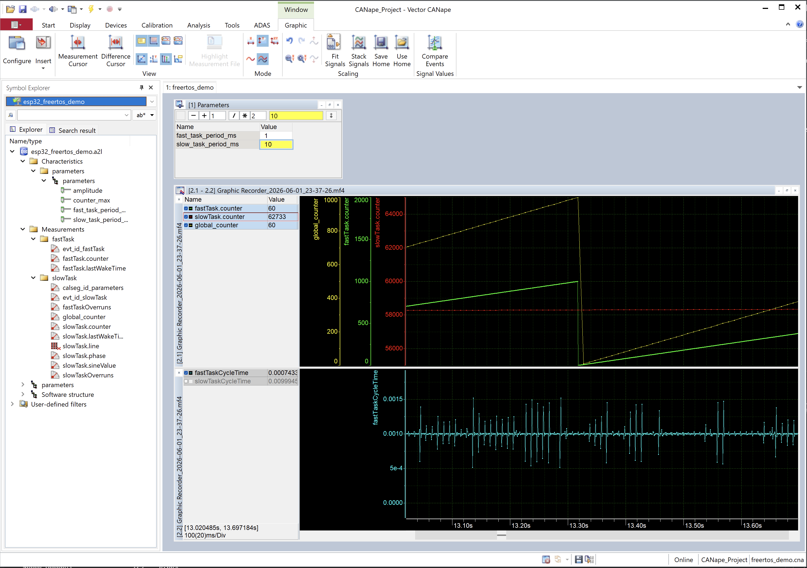

# ESP32 FreeRTOS Demo

This example runs XCPlite on an ESP32 board using the Arduino framework and the ESP32 FreeRTOS/lwIP runtime.


## What it Shows

The included CANape project and the XCP instrumentation in `main.cpp` show:

- Creating a high priority FreeRTOS task (fastTask) with precise cyclic execution timing
- Creating a lower priority FreeRTOS task (slowTask) for background work
- Pinning them to the same core to watch scheduling in action
- Triggering XCP events in both tasks and acquiring global and local measurement variables
- Provide 1 us resolution XCP measurement event timestamps
- Display cycle time jitter of the tasks in CANape
- Counting task deadline overruns when calibrated periods are too aggressive
- Creating thread-safe calibration parameters accessible in both tasks
- Calibrating task cycle times and the amplitude of a floating-point sine measurement
- Observing both task trigger points with a two-channel oscilloscope to evaluate XCP instrumentation cost


## Preconditions

You need:

- vscode with PlatformIO installed, or PlatformIO Core available as `pio`.
- An ESP32-S3 board compatible with `lilygo-t-display-s3`, or an adapted `platformio.ini`.
- A 2.4 GHz WLAN. ESP32 does not connect to 5 GHz-only networks.
- The ESP32 and the PC running the XCP client must be on the same network.
- `xcpclient` for testing and offline A2L generation (see getting xcpclient below).
- A CANape full licence or demo version


## Demo Details

The demo currently:

- Connects the ESP32 to a 2.4 GHz WLAN.
- Scans for the configured SSID and selects the strongest matching BSSID.
- Prints Wi-Fi RSSI, channel, encryption mode, BSSID, disconnect reason, and assigned IP address.
- Starts the XCPlite server after Wi-Fi is connected.
- Binds the XCP UDP server to `0.0.0.0:5555`.
- Displays some status on the T-Display-S3 LCD using LovyanGFX.
- Creates the 2 demo tasks

### Scope Pins

Both demo tasks are pinned to the same ESP32 core so the scheduler interaction is visible in XCP measurements and on a scope:

- `fastTask`: GPIO2 / IO2, default period 1 ms
- `slowTask`: GPIO1 / IO1, default period 10 ms

Connect both probe grounds to board GND. The pins are driven high while the task is running.


### Task Overrun Counters

Both demo tasks use `xTaskDelayUntil()` for absolute periodic scheduling. This avoids drift: each activation is scheduled relative to the previous planned activation time, not relative to the moment the task happens to finish its work.

`xTaskDelayUntil()` returns `pdFALSE` when the task is already past its next planned wake-up time. The demo counts this as a deadline overrun:

- `fastTaskOverruns`: missed deadlines in the high-priority fast task
- `slowTaskOverruns`: missed deadlines in the lower-priority slow task

These counters are useful when experimenting with the calibrated task periods. If a period is set too short, or if both same-core tasks plus XCP processing need more CPU time than the schedule allows, the counters start increasing. In normal operation with the default periods they should stay at zero or increase only during exceptional pauses such as startup or heavy debug logging.


## Quick Path

1. Configure Wi-Fi credentials in `src/wlan.h` or via PlatformIO build flags.
2. Build and upload the firmware:
   ```bash
   pio run --target upload
   ```
3. Open the serial monitor and note the ESP32 IP address:
   ```bash
   pio device monitor
   ```
4. Generate the A2L file from the firmware ELF:
   ```bash
   xcpclient --offline --elf .pio/build/lilygo-t-display-s3/firmware.elf --a2l esp32_freertos_demo.a2l --elf-unit-filter main_cpp
   ```
5. Connect with CANape using `CANape_Project`, or run a basic xcpclient measurement test:
   ```bash
   xcpclient --udp --dest-addr <esp32-ip-address> --a2l esp32_freertos_demo.a2l --mea global_counter
   ```


## Wi-Fi Credentials

The sketch includes `wlan.h` when `WIFI_SSID` or `WIFI_PASSWORD` are not provided by build flags:

```cpp
#if !defined(WIFI_SSID) || !defined(WIFI_PASSWORD)
#include "wlan.h"
#endif
```

Example:
```cpp
#pragma once

#define WIFI_SSID "your-ssid"
#define WIFI_PASSWORD "your-password"
```

`wlan.h` is ignored by this example's `.gitignore`.

Alternatively, pass credentials with PlatformIO build flags:

```ini
build_flags =
    -DWIFI_SSID=\"your-ssid\"
    -DWIFI_PASSWORD=\"your-password\"
```


## Configure, Build and Run

### Configure

The XCPlite repository `inc/` and `src/` folders need to be in the include path.

Define `_FREE_RTOS` and `XCPLIB_CFG_OVERRIDE="xcplib_rtos_cfg.h"` for the FreeRTOS specific code paths and configuration options.

This build of XCPlite:
- Uses the FreeRTOS/lwIP socket and clock abstraction layer in `src/platform.c`.
- Uses the mutex based 32-bit queue implementation `src/queue32.c`.


XCP server connection options are set in main.cpp
- XCP on Ethernet over UDP
- XCP server port: `5555`

TCP is currently not supported.  

Stack size settings, DAQ list size, DAQ queue size, maximum number of events and calibration segments influence memory consumption and may be tuned. 


### Memory Consumption

Check log-level 5 for information about memory usage:

Example:
```
XcpInit name=stm32_freertos_demo, epk=V100, mode=01
  sizeof(tXcpData)=8200  sizeof(tXcpLocalData)=176
XcpEthServerInit
  sizeof(gXcpServer)=24
Init transport layer queue (queue32)
  buffer_size=8896, queue_size=6 (8896 Bytes)
```

The 32 bit transmit queue (queue_size given in bytes) is allocated with 2 mallocs for header and data. The given queue size in bytes is rounded down to match multiples of the transport layer segment size. There are no other mallocs in the 32 bit FreeRTOS build.  
If using malloc is not acceptable, XcpEthServerInit could be changed to accept a memory buffer given as a parameter, but this would lead to some rounding waste.  

The memory size of static tXcpData is depending on the configuration in xcplib_cfg. and xcplib_rtos_cfg.h:  
- OPTION_CAL_SEGMENT_COUNT: Max number of calibration segments or blocks
- OPTION_CAL_MEM_SIZE: Space reserved for calibration data swapping and working pages (needs: 3 * page size * segment count)
- #define OPTION_DAQ_MEM_SIZE: Memory size for DAQ tables (needs: 6 bytes per measurement with full fragmentation)
- #define OPTION_DAQ_EVENT_COUNT: Maximum number of DAQ events

The stack size of the XCP rx and tx task may be defined in xcplib_rtos_cfg.h.  
It is important to check these values, not to waste unnecessary memory.

Example:
```
#define OPTION_FREERTOS_STACK_BYTES (8U * 1024U)
#define OPTION_FREERTOS_PRIORITY (tskIDLE_PRIORITY + 2U)
```

For further optimization, the stack size for the receive and transmit task should be tuned differently, because the rx path has higher stack usage than the tx path.  
The stack usage of the XCP code parts has been optimized, but lwip sockets stack usage might depend on configuration.  
Both XCP tasks currently use one tXcpCtoMessage (roughly MAX_CTO_SIZE+4 = 252 bytes) on stack, which may be optimized further.  


### Build

XCPlite source files are built directly from the XCPlite repository `src/` folder.  
Building a library could be added later.  

If `pio` is in your shell path:

```bash
pio run
```

### Upload

The current serial port is configured in `platformio.ini`:

Example:
```ini
upload_port = /dev/cu.usbmodem101
monitor_port = /dev/cu.usbmodem101
```

Adjust it if your board enumerates differently:
```bash
pio device list
```

Upload:
```bash
pio run --target upload
```

If upload has trouble entering the bootloader, hold BOOT while upload starts and release it when PlatformIO prints `Connecting...`.


### Serial Monitor

```bash
pio device monitor
```

You should see log messages from the XCP server.  
The log level may be set with XCP_LOG_LEVEL.


### Network Test

First confirm that the board confirms receiving an IP address in the serial log.

Then try:
```bash
ping <esp32-ip-address>
```

The XCP server listens on UDP port `5555`.


### XCP test

Execute a basic XCP connection test:

```bash
xcpclient --udp --dest-addr <esp32-ip-address>
```

The upload A2L file error message can be ignored, as the FreeRTOS implementation does not support on-target A2L generation and A2L upload.


## Offline A2L generation

Get the ELF file and generate the A2L file with xcpclient (see getting xcpclient below).

Recommended command from this example directory:

```bash
xcpclient --offline --elf .pio/build/lilygo-t-display-s3/firmware.elf --a2l esp32_freertos_demo.a2l --elf-unit-filter main_cpp
```

`--elf-unit-filter main_cpp` keeps the generated A2L focused on this demo application instead of adding all symbols from all linked code.

Advanced examples:

```bash
# Add everything (not recommended):
xcpclient --offline --elf .pio/build/lilygo-t-display-s3/firmware.elf --a2l esp32_freertos_demo.a2l

# Get verbose output with --verbose 1 or 2 and --log-level 4 or 5:
xcpclient --offline --elf .pio/build/lilygo-t-display-s3/firmware.elf --a2l esp32_freertos_demo.a2l --elf-unit-filter main_cpp --verbose 2 --log-level 4 > esp32_freerto_demo.log

```

Note that the A2L generator is not considered stable yet. 
It has been tested with ELF files from Linux gcc and clang tool chains.  

See the documentation of xcpclient and the other examples for more information on working with offline A2L generation.  


## Test XCP Measurement

With xcpclient

Watch the fastTask counter

```bash
xcpclient --udp --dest-addr <esp32-ip-address> --a2l esp32_freertos_demo.a2l --mea global_counter --verbose 2
```

Watch scheduler pressure:

```bash
xcpclient --udp --dest-addr <esp32-ip-address> --a2l esp32_freertos_demo.a2l --mea fastTaskOverruns --verbose 2
```

Calibrate

```bash
xcpclient --udp --dest-addr <esp32-ip-address> --a2l esp32_freertos_demo.a2l --cal parameters.counter_max 500
```

Or use the CANape project in folder `CANape_Project`.



Notes on CANape:
- To enable the CANape internal ELF/DWARF reader and address updater, select the Map file reader: 'C# version with extended C++ support'.  
- CANape will read the IP address of the XCP server from the generated A2L file. The xcpclient A2L generator writes the ip address given on its command line or otherwise defaults to 127.0.0.1.  
- CANape does not support address update for local variables on stack. Don't use local variables when using the build-in address updater!.  

### What to Measure

Good first measurements:
- `global_counter`: global fast task activity counter
- `fastTaskOverruns`: high-priority task missed deadlines
- `slowTaskOverruns`: lower-priority task missed deadlines
- `counter` in `fastTask`: local stack measurement near the fast task DAQ trigger
- `counter` and `sineValue` in `slowTask`: local stack measurements near the slow task DAQ trigger

And calibration parameters to play with:
- `parameters.fast_task_period_ms`: calibratable fast task period
- `parameters.slow_task_period_ms`: calibratable slow task period
- `parameters.amplitude`: calibratable sine amplitude
- `parameters.counter_max`: the maximum value of the fast task counter, global_counter variables

The local variables are intentionally marked `volatile` in `main.cpp` so optimized builds keep them visible enough for offline ELF/DWARF based A2L generation.


## Code instrumentation for offline A2L generation

The A2L file generator in xcpclient scans the ELF file for measurement event and calibration segment markers and automatically creates calibration and measurement variables with complex types, visible in the instrumented XCP measurement event trace points. This includes local variables in the function calling the event trigger.  

Precondition is, that the code (C and C++) uses the instrumentation macros, not the plain XCPlite C API functions. The macros generate constants in the .rodata sections xcp_evts and xcp_cals. The event trigger macros generate local static variables to identify the location of the XCP trace points. The A2L generator inspects the location expressions in ELF/DWARF and identifies local variables visible in the XCP event trigger scope. Note that local variables may become invisible with compiler optimizations. Mark selected demo measurements with volatile to force the compiler to keep them and spill them to stack.  

How to use the instrumentation macros is shown in the example code in `main.cpp`.  

## Getting xcpclient

`xcpclient` is used for two jobs in this demo:

- generating an A2L file from the firmware ELF
- running simple command-line XCP connection and measurement tests

### Recommended: Prebuilt Binary

For normal demo users, the recommended distribution model is a prebuilt binary matching the XCPlite release version. The binary should be taken from the matching XCPlite/xcp-lite release and put somewhere in your shell `PATH`.

Recommended release artifact naming:

```text
xcpclient-v2.1.0-macos-aarch64
xcpclient-v2.1.0-linux-x86_64
xcpclient-v2.1.0-windows-x86_64.exe
```

The important rule is version matching: the `xcpclient` version, the Rust `xcp-lite` version, and the C/C++ XCPlite headers/sources used by this firmware should belong to the same release or branch.

### Developer Path: Build from Rust Sources

If no matching binary is available, build `xcpclient` from source. This is more complex because the Rust `xcp-lite` repository contains the A2L database/generator code and includes the C/C++ XCPlite repository as a submodule.

For the current development state, use matching branches of both repositories, for example `V2.1.0` on your XCPlite fork and the corresponding `V2.1.0` branch of your `xcp-lite` fork.

Typical example workflow:

```bash
cd git
git clone --recursive <xcp-lite-repository-url>
git clone  <XCPlite-repository-url>
cd git xcp-lite
git checkout V2.1.0
git submodule update --init --recursive
cd git/XCPlite
git checkout V2.1.0
cd tools/xcpclient
cargo build --release
cargo install --path .
```

After installation, confirm that the tool is reachable:

```bash
xcpclient --help
```


## Adapting to other ESP32 Hardware in PlatformIO

Change the PlatformIO board in `platformio.ini`:

```ini
board = esp32dev
```

or choose the exact board ID from PlatformIO.

For a board without the LilyGo display:

- Remove `lovyan03/LovyanGFX` from `lib_deps`.
- Leave `OPTION_DISPLAY` undefined.


## Adapting to other FreeRTOS based hardware platforms

### Clock

For precise event time stamping, XCP needs a high precision free running 64 bit counter.
The counter must wrap around at exactly `0xFFFFFFFFFFFFFFFF`, which may be considered non-wrapping for practical runtimes.
There is no option for a different wrap value.
Clock zero may be arbitrary: it could be a PTP epoch, or it could start at zero when booting.
Unless XCP states that the clock is PTP synchronized TAI, XCP client tools do not care about the epoch.

The function `clockGet()` in `platform.c` serves this purpose.
On ESP32, `platform.c` detects `ESP_PLATFORM` and uses the ESP-IDF high resolution timer:

```c
uint64_t clockGet(void) {
    uint64_t t = (uint64_t)esp_timer_get_time(); // 1 us ticks since boot
    gClockLast_ = t;
    return t;
}
```

For other FreeRTOS targets, the implementation falls back to `xTaskGetTickCount()`, which has only scheduler tick resolution.
The clock resolution must be specified in `xcplib_rtos_cfg.h`:

```c
#undef OPTION_CLOCK_TICKS_1NS
#define OPTION_CLOCK_TICKS_1US // 1 us ticks
```

With the ESP32 backend, this advertises a 64 bit timestamp clock with 1 us ticks.
At 1 us resolution, the `0xFFFFFFFFFFFFFFFF` wrap point is about 584,542 years after clock zero.
On ESP32, selecting `OPTION_CLOCK_TICKS_1NS` intentionally raises a compile-time error because `esp_timer_get_time()` is a 1 us timer.
If ns-scaled timestamps are really required, remove that guard in `platform.c` and scale the `esp_timer_get_time()` result explicitly.

To use resolutions other than 1 ns or 1 us, `xcp_cfg.h` and the XCP timestamp unit configuration have to be adapted consistently.


## XCPlite Source Selection

The PlatformIO build uses `extra_script.py` to compile only the source files needed for 32 bit embedded target:

```text
src/xcpappl.c
src/xcplite.c
src/xcpethserver.c
src/xcpethtl.c
src/queue32.c
src/cal.c
src/platform.c
```

The source files remain in the XCPlite repository `src/` folder. They are not copied into this example.


## Known Limitations

- FreeRTOS targets do not support on-target A2L generation or A2L upload in this demo. Generate the A2L offline from the ELF file.
- The offline A2L generator is not stable. Keep xcpclient/xcp-lite and XCPlite versions aligned.
- Local variable measurement depends on compiler debug information and optimization behavior. Selected demo locals are marked `volatile` to improve visibility.


## TODO

- Don't create a fixed event for global variables and add them to group 'Measurement'
- Fix xcpclient issue if `XCP_104.aml` (included in the generated A2L file) is missing, xcpclient may not yet produce a helpful error message.
- Check if the mutex based queue is acceptable or if we should port one of the lockless queue implementations based on 64Bit atomic head and tail
- Add TCP support
- Do some benchmarking on CPU load, event trigger and calibration RCU latency
