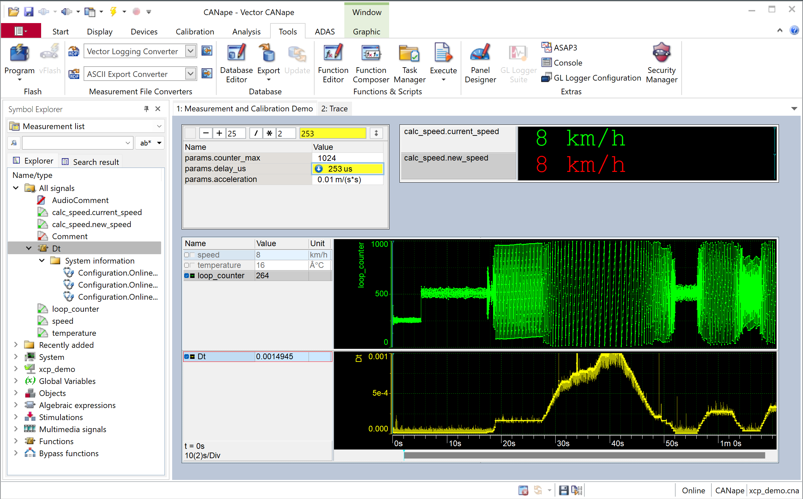

# hello_xcp Demo

## Overview

Basic XCPlite example in C.  
  
Demonstrates how to start the XCP on Ethernet server and use the runtime A2L generator.  

Shows how to create a calibration parameter segment structure, register the parameters in the segment and access them safely.  
Defines events for measurement of global and local variables.  
Demonstrates the different addressing modes for variables and parameters.  
Defines a function, registers local variables and function parameters and creates and triggers a measurement event in the function.  

More advanced topics are covered by the other examples:  

- Create a C++ application, use the C++ RAII calibration segment wrapper.  
- Safely share calibration parameters among different threads.  
- Measure instances of complex types, such a structs, arrays, nested structs and arrays of structs by using typedefs.  
- Create complex parameters, like maps, curves and lookup tables with fixed or shared axis.  
- Measure thread local instances of variables, create event instances.  
- Create physical conversion rules and enumerations.  
- Create additional groups.  
- Use consistent atomic calibration.  
- Make calibration changes persistent (freeze).  
- Create context and span, measure durations.  

## CANape Screenshot



## A2L File

This is an excerpt of the generated A2L file:  

```

/* Segment relative addressing mode: calseg=Parameters */
/begin CHARACTERISTIC params.counter_max "Maximum counter value" VALUE 0x80010000 U16 0 NO_COMPU_METHOD 0 2000 /end CHARACTERISTIC
/begin CHARACTERISTIC params.delay_us "Mainloop delay time in us" VALUE 0x80010004 U32 0 NO_COMPU_METHOD 0 999999 PHYS_UNIT "us" /end CHARACTERISTIC
/begin CHARACTERISTIC params.acceleration "Acceleration" VALUE 0x80010008 F32 0 NO_COMPU_METHOD -10 10 PHYS_UNIT "m/(s*s)" /end CHARACTERISTIC

/* Absolute addressing mode: default_event=mainloop (0), addr_ext=1 */
/begin MEASUREMENT temperature "Motor temperature in °C" UBYTE conv.temperature_conversion 0 0 -55 200 ECU_ADDRESS 0x24002 ECU_ADDRESS_EXTENSION 1 READ_WRITE /begin IF_DATA XCP /begin DAQ_EVENT VARIABLE /begin DEFAULT_EVENT_LIST EVENT 0x0 /end DEFAULT_EVENT_LIST /end DAQ_EVENT /end IF_DATA /end MEASUREMENT
/begin MEASUREMENT speed "Speed in km/h" FLOAT32_IEEE NO_COMPU_METHOD 0 0 0 250 ECU_ADDRESS 0x240B8 ECU_ADDRESS_EXTENSION 1 PHYS_UNIT "km/h" READ_WRITE /begin IF_DATA XCP /begin DAQ_EVENT VARIABLE /begin DEFAULT_EVENT_LIST EVENT 0x0 /end DEFAULT_EVENT_LIST /end DAQ_EVENT /end IF_DATA /end MEASUREMENT

/* Stack frame relative addressing mode: event=mainloop (0), addr_ext=3 */
/begin MEASUREMENT loop_counter "Loop counter, local measurement variable on stack" UWORD NO_COMPU_METHOD 0 0 0 65535 ECU_ADDRESS 0xFFFFFFEE ECU_ADDRESS_EXTENSION 3 /begin IF_DATA XCP /begin DAQ_EVENT FIXED_EVENT_LIST EVENT 0x0 /end DAQ_EVENT /end IF_DATA /end MEASUREMENT

/* Stack frame relative addressing mode: event=calc_speed (1), addr_ext=3 */
/begin MEASUREMENT calc_speed.current_speed "Parameter current_speed in function calculate_speed" FLOAT32_IEEE NO_COMPU_METHOD 0 0 0 250 ECU_ADDRESS 0xFFFFFFFC ECU_ADDRESS_EXTENSION 3 PHYS_UNIT "km/h" /begin IF_DATA XCP /begin DAQ_EVENT FIXED_EVENT_LIST EVENT 0x1 /end DAQ_EVENT /end IF_DATA /end MEASUREMENT
/begin MEASUREMENT calc_speed.new_speed "Loop counter, local measurement variable on stack" FLOAT32_IEEE NO_COMPU_METHOD 0 0 0 250 ECU_ADDRESS 0xFFFFFFF8 ECU_ADDRESS_EXTENSION 3 PHYS_UNIT "km/h" /begin IF_DATA XCP /begin DAQ_EVENT FIXED_EVENT_LIST EVENT 0x1 /end DAQ_EVENT /end IF_DATA /end MEASUREMENT

```
