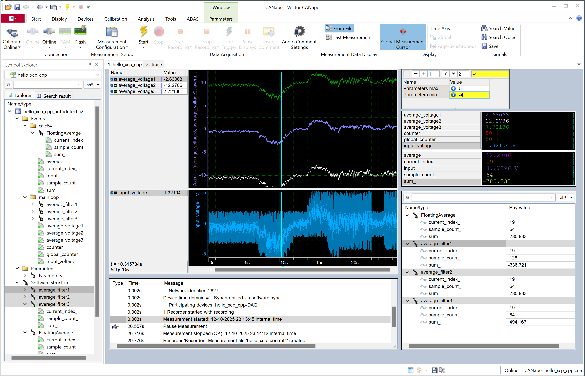

# hello_xcp_cpp Demo

## Overview
  
An example in C++ using more idiomatic C++ to demonstrate the capabilities of the additional C++ API.  
- Start the XCP on Ethernet server and use the runtime A2L generator.  
- Create a global calibration parameter segment structure, register the parameters in the segment and access them safely with a RAII wrapper.  
- Define events for measurement of global, local (stack), member and heap variables, and instances of classes.  
- Use the variadic C++ macro/template API.  
- Instrument a member function: Register and measure local function variables and parameters.  

More advanced topics are covered by the other examples:  

- Safely share calibration parameters among different threads.  
- Measure instances of complex types, such a structs, arrays, nested structs and arrays of structs by using typedefs.  
- Create complex parameters, like maps, curves and lookup tables with fixed or shared axis.  
- Measure thread local instances of variables, create event instances.  
- Create physical conversion rules and enumerations.  
- Create additional groups.  
- Use consistent atomic calibration.  
- Make calibration changes persistent (freeze).  
- Create context and span, measure durations.  

## CANape Screenshot

## A2L File

The generated A2L file can be found in the CANape project folder.  

