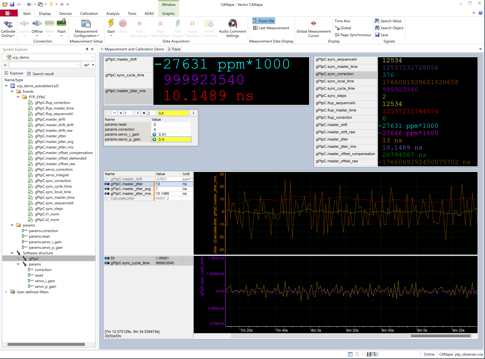

# PTP Demo

## Overview

This demo application implements a simple PTP (Precision Time Protocol, IEEE 1588) observer and a basic PTP master.

### Commandline Options

```
ptp_demo [options]  
Options:
  -i, --interface <name>        Network interface name (default: eth0)
  -m, --mode <mode>             PTP mode: observer or master (default: observer)
  -d, --domain <number>         PTP domain number 0-255 (default: 0)
  -u, --uuid <hex>              PTP UUID as 16 hex digits (default: 001AB60000000001)
  -h, --help                    Show this help message

Example:
  ptp_demo -i en0 -m master -d 1 -u 001AB60000000002
```


## PTP Observer

This demo showcases a PTP (Precision Time Protocol, IEEE 1588) observer instrumented with XCP.  
The observer captures PTP SYNC and FOLLOW_UP messages and calculates drift and jitter.  
Running on a Linux system with good hardware time stamping support, the observer can give an estimate of the clock quality of a PTP master. 


The implementation of PTP is very basic and assumes there is only one PTP master and one clock domain on the network.  
The filtering and clock servo algorithms are also simplistic and need significant time to stabilize to obtain a reliable estimation of master clock jitter.  

The demo must be run with root privileges to access hardware time stamping features and the PTP ports.

```bash
sudo ./build/ptp_demo

  t1 (SYNC tx on master (via PTP))  = 1.1.1970 03:34:01 +231742000ns (12841231742000) 
  t2 (SYNC rx)  = 18.12.2025 18:22:13 +673412218ns (1766082133673412218) 
  correction          = 376ns
  cycle_count         = 1059
  master_drift        = -27670ns/s
  master_drift_drift  = -1ns/s2
  master_jitter_rms   = 7.68115 ns


```

## PTP Master

The demo can also be run as a simple PTP master, sending SYNC and FOLLOW_UP messages periodically and reponding to DELAY_REQUEST messages.  
This can be enabled by defining the `OPTION_ENABLE_PTP_MASTER` macro in `ptp_cfg.h`.  
The master implementation is very basic and does not implement all required PTP features.  


## Hardware Requirements

Check ethernet interface supports hardware time stamping:
```bash
ip link show # Find your ethernet interface name, e.g., eth0
sudo ethtool -T eth0  # Replace eth0 with your interface name
```

Check for PTP hardware clock devices:
```bash
ls -l /dev/ptp*
```

Check kernel support:
```bash
cat /boot/config-$(uname -r) | grep -i timestamp
```


## CANape Screenshot




