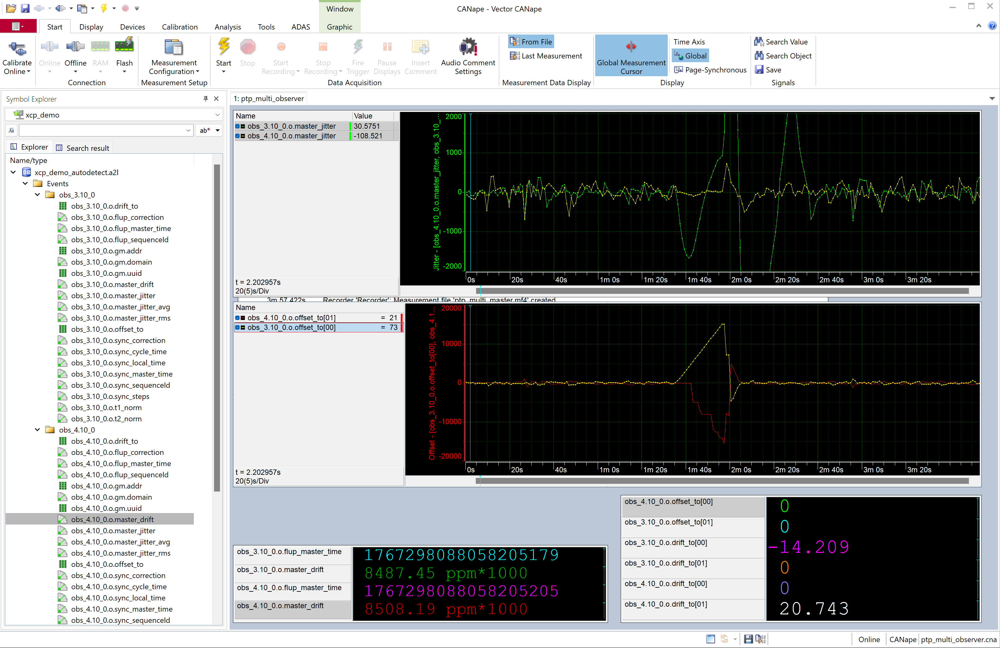

# PTP Demo

## Overview

This demo application implements a simple PTP (Precision Time Protocol, IEEE 1588) observer and a basic PTP master.
Use case may be analyzing PTP masters and testing PTP client stability
Supports IEEE 1588-2008 PTPv2 over UDP/IPv4 in E2E mode

### Commandline Options

```
Usage: ./build/ptp_demo [options]
Options:
  -i, --interface <name>  Network interface name (default: eth0)
  -m, --master            Creates a PTP master with uuid and domain
  -o, --observer          Observer for uuid and domain (default: multi observer)
  -d, --domain <number>   Domain number 0-255 (default: 0)
  -u, --uuid <hex>        UUID as 16 hex digits (default: 001AB60000000001)
  -l, --loglevel <level>  Set log level (0..5)
  -h, --help              Show this help message

Example:
  ./build/ptp_demo -i en0 -m master -d 1 -u 001AB60000000002
```


## PTP Master

The demo can be run as a simple PTP master, sending SYNC and FOLLOW_UP messages periodically and responding to DELAY_REQUEST messages.  
The master implementation is very basic and does not implement all required PTP features.  

The master clock has adjustable offset, jitter and frequency by XCP calibration parameters.  
Typical use case is to test PTP clients or to provide multiple PTP masters on different network interfaces with different clock qualities.


## PTP Observer

In observer mode, the application creates a PTP (Precision Time Protocol, IEEE 1588) master observer instrumented with XCP.  
The observer captures PTP SYNC and FOLLOW_UP messages from a PTP time provider on the given domain and uuid and calculates drift and jitter.  
Running on a Linux system with good hardware time stamping support, the observer can give an estimate of the clock quality of one or multiple  PTP master.  
  
If no mode is specified, the application creates multiple observers for each PTP master with any domain and uuid seen.  
It calculates drift and time offsets between the different masters.  
Typical use case is to compare different PTP4L instances running on a logging PC with multiple network interfaces, while the associated PHC clocks are synchronized by PHC2SYS.  
  
The filtering and clock servo or linreg algorithms are very basic and need significant time to stabilize to obtain a reliable estimation of master clock jitter and drift. On systems with high drift of drift (frequency change rate) or high jitter, the measurement values may be unreliable.  
  
The demo must be run with root privileges to access to hardware time stamping features and the PTP ports.  


Example: multi observer mode:

```bash

# Start two PTP masters on different interfaces (in separate terminals or background)
sudo ./build/ptp_demo --master -i enp4s0
sudo ./build/ptp_demo --master -i enp5s0
# Sync PHC clocks of both interfaces
sudo phc2sys -s enp4s0 -c enp5s0 -m -l 7 -O 0

# Run multi observer to compare both masters
sudo ./build/ptp_demo

  Observer obs_4.10_0: PTP SYNC cycle 26:
  Average filtered drift calculation results at t2 = 25183419120 ns: 
    master_drift        = 8565.2 ns/s
    master_drift_drift  = 13.6506 ns/s2
  Linear regression results at t2 = 25183419120 ns: 
    linreg drift = 8552.45 ns/s
    linreg drift_drift = 0.896657 ns/s2
    linreg offset = -83.1948 ns
    linreg offset average = 1.63328 ns
    linreg jitter = -84.8281 ns
    linreg jitter average = -2.07255 ns
  Jitter analysis:
    master_jitter       = -84.8281 ns
    master_jitter_avg   = -7.47743 ns
    master_jitter_rms   = 86.5982 ns
  Comparisons to other observers:
    offset to obs_3.10_0: 20 ns (2e-05 ms)
    drift diff to obs_3.10_0: -9.79223 ns/s

Observer obs_3.10_0: PTP SYNC cycle 27:
  Average filtered drift calculation results at t2 = 26191148000 ns: 
    master_drift        = 8562.4 ns/s
    master_drift_drift  = 0.165029 ns/s2
  Linear regression results at t2 = 26191148000 ns: 
    linreg drift = 8563.18 ns/s
    linreg drift_drift = 0.935543 ns/s2
    linreg offset = -94.3429 ns
    linreg offset average = 32.1495 ns
    linreg jitter = -126.492 ns
    linreg jitter average = 1.02404 ns
  Jitter analysis:
    master_jitter       = -126.492 ns
    master_jitter_avg   = 3.78518 ns
    master_jitter_rms   = 167.315 ns
  Comparisons to other observers:
    offset to obs_4.10_0: 172 ns (0.000172 ms)
    drift diff to obs_4.10_0: 10.7278 ns/s


```

### CANape Screenshot




## Hardware Requirements

Check ethernet interface supports hardware time stamping:
```bash
ip link show # Find your ethernet interface name, e.g., eth0
sudo ethtool -T eth0  # Replace eth0 with your interface name
```

Check for PTP hardware clock devices:
```bash
ls -l /dev/ptp*
```

Check kernel support:
```bash
cat /boot/config-$(uname -r) | grep -i timestamp
```


