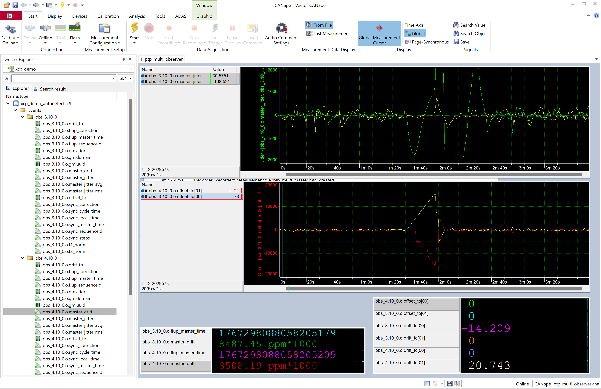

# PTP Tool

## Overview

A command line tool which acts as a PTP observer or PTP time server with XCP instrumentation for testing PTP synchronization.  
The PTP observer listens for PTP messages on the network and separates drift and jitter of the master clock in relation to the observers local clock. 
The PTP master sends SYNC and FOLLOW_UP messages periodically and responds to DELAY_REQUEST messages, while tracking the number of connected PTP clients. Drift and jitter of the master clock may be modified by XCP, for testing the stability of PTP client clocks. 

Supports IEEE 1588-2008 PTPv2 over UDP/IPv4 in E2E mode.  

### Commandline Options

```
Usage: ./build/ptptool [options]
Options:
  -i, --interface <name>  Network interface name (default: eth0)
  -m, --master            Creates a PTP master with uuid and domain
  -o, --observer          Observer for uuid and domain
  -a, --auto              Multi observer mode
  -p, --passive           Passive observer mode (default: active)
  -d, --domain <number>   Domain number 0-255 (default: 0)
  -u, --uuid <hex>        UUID as 16 hex digits (default: 001AB60000000001)
  -l, --loglevel <level>  Set PTP log level (0..5, default: 1)
  -h, --help              Show this help message

Example:
  ./build/ptptool -i en0 -m master -d 1 -u 001AB60000000002
```

## PTP client mode

```bash

# Start PTP4L and PHC2SYS in parallel to provide PTP synchronized system realtime clock
sudo ptp4l -4 -H -i eth0 -s --tx_timestamp_timeout 100 -l 7 -m 
sudo phc2sys -c CLOCK_REALTIME -s eth0 -w  -l 7 -m

# Use XCP with PTP4L and PHC2SYS synchronized PTP hardware clock
sudo ./build/ptptool -c -i eth0

```


## PTP Master

The demo can be run as a simple PTP grandmaster, sending SYNC and FOLLOW_UP messages periodically and responding to DELAY_REQUEST messages.  
The master implementation is very basic and does not implement all required PTP features.  

The grandmaster clock has adjustable offset, jitter and frequency by XCP calibration parameters.  
Typical use case is to test PTP clients or to provide multiple PTP masters on different network interfaces with different clock qualities.


## PTP Observer

In observer mode, the application creates a PTP (Precision Time Protocol, IEEE 1588) observer instrumented with XCP.  
The observer captures PTP SYNC and FOLLOW_UP messages from a PTP time provider on the given domain and uuid and calculates drift and jitter.  
Running on a Linux system with good hardware time stamping support, the observer can give an estimate of the clock quality of one or multiple  PTP grandmasters.  
  
If no mode is specified, the application creates multiple observers for each PTP grandmaster with any domain and uuid seen.  
It calculates drift and time offsets between the different masters.  
Typical use case is to compare different PTP4L instances running on a logging PC with multiple network interfaces, while the associated PHC clocks are synchronized by PHC2SYS.  
  
The filtering and clock servo or linreg algorithms are very basic and need significant time to stabilize to obtain a reliable estimation of master clock jitter and drift. On systems with high drift of drift (frequency change rate) or high jitter, the measurement values may be unreliable.  
  
The demo must be run with root privileges to access to hardware time stamping features and the PTP ports.  


Example: multi observer mode:

```bash

# Start two PTP masters on different interfaces (in separate terminals or background)

# Note: PHC synchronization
# The PHC (PTP Hardware Clock) must be synchronized before meaningful measurements.
# If ptptool reports "PHC is NOT synchronized", the hardware clock needs to be set.
#
# Option 1: Let ptptool in master mode initialize it (starts with system time)
# Option 2: Run ptp4l which will synchronize the PHC to a PTP master  
#
# Note: On some systems (e.g., Raspberry Pi with Cadence GEM), the PHC may be locked
# by the network driver and cannot be manually set. This is a known limitation.
# In this case, only PTP synchronization (running as slave to a PTP master) can
# update the PHC. The warning about PHC not being synchronized is informational -
# it means the system just booted and PTP hasn't synchronized yet.
#
# Note: Once synchronized by PTP, the PHC maintains its own time and may drift
# from system time. This is normal - PTP keeps the PHC accurate, not system time.


# Using ptptool time servers

# On a Raspberry Pi 5
sudo ./build/ptptool -m -i eth0 -d 0

# On a VP6450
sudo ./build/ptptool -m -i eno0 -d 0
sudo ./build/ptptool -m -i enp4s0 -d 1
sudo ./build/ptptool -m -i enp5s0 -d 2
sudo ./build/ptptool -m -i enp2s0f0 -d 3
sudo ./build/ptptool -m -i enp2s0f1 -d 4


# Using ptp4l time servers
sudo ptp4l -H -i enp2s0f0  -p /dev/ptp3  -m  --tx_timestamp_timeout=100 --domainNumber=2 -l 7  --verbose=1
sudo ptp4l -H -i enp2s0f1  -p /dev/ptp4  -m  --tx_timestamp_timeout=100 --domainNumber=2 -l 7  --verbose=1
sudo ptp4l -H -i enp4s0  -p /dev/ptp1  -m  --tx_timestamp_timeout=100 --domainNumber=1 -l 7  --verbose=1
sudo ptp4l -H -i enp5s0  -p /dev/ptp0  -m  --tx_timestamp_timeout=100 --domainNumber=2 -l 7  --verbose=1


# Other options:
# --masterOnly=1 (should the same as -m)
# --time_stamping=hardware  (should be default and the same a -H)
# --verbose=1 (should be default)
# --BMCA=noop
# --free_running=1  
# --clock_servo=nullf
# --logSyncInterval=-1
# --tx_timestamp_timeout 100

# Sync PHC clocks from system realtime clock
sudo phc2sys -s CLOCK_REALTIME  -c enp5s0   -m -l 7 -O 0 
sudo phc2sys -s CLOCK_REALTIME  -c enp2s0f0   -m -l 7 -O 0 
# Check PHC frequency adjustment
sudo phc_ctl /dev/ptp0 freq
sudo phc_ctl /dev/ptp3 freq

# Sync PHC clocks of 2 interfaces
sudo phc2sys -s enp5s0 -c enp2s0f0 -m -l 7 -O 0


# Run multi observer on a different PC over a PTP transparent network switch to compare both masters
sudo ./build/ptptool -a

  
  ### Test on VP6450 on Debian Linux 
  
Create PTP masters in 2 interfaces enp2s0f0 (10G1, /dev/ptp3) and enp5s0 (1G2, /dev/ptp0)
Sync both PHC clocks with /dev/ptp0 as reference

enp2s0f0 (10G1, MAC=68:b9:83:01:47:98, UUID=68b983.fffe.014798) with /dev/ptp3
enp5s0 (1G2, MAC=68:b9:83:01:47:99, UUID=68b983.fffe.014799) with /dev/ptp0

```bash
sudo ptp4l -H -i enp2s0f0  -p /dev/ptp3  -m  --tx_timestamp_timeout=100 --domainNumber=2 -l 7  --verbose=1
sudo ptp4l -H -i enp5s0  -p /dev/ptp0  -m  --tx_timestamp_timeout=100 --domainNumber=2 -l 7  --verbose=1
sudo phc2sys -s /dev/ptp0 -c enp2s0f0 -m -l 7 -O 0

```

### CANape Screenshot




## Hardware Requirements

Check ethernet interface supports hardware time stamping:
```bash
ip link show # Find your ethernet interface name, e.g., eth0
sudo /usr/sbin/ethtool -T eth0  # Replace eth0 with your interface name
```

Check for PTP hardware clock devices:
```bash
ls -l /dev/ptp*
```

Check kernel support:
```bash
cat /boot/config-$(uname -r) | grep -i timestamping
```


# Tools

Check phc clock frequency adjustment:

```bash 
sudo phc_ctl /dev/ptp0 freq

```


Check which PHC belongs to which interface

```bash 
for iface in /sys/class/net/*; do
  if [ -d "$iface/device/ptp" ]; then
    echo "Interface: $(basename $iface)"
    ls -l $iface/device/ptp/
  fi
done
```


# Debugging Guide

```bash
# Trace for correct enabling of hardware time stamping
sudo strace -e trace=setsockopt ./build/ptptool --master -i enp4s0 
```

Build linuxptp with debug symbols:

```bash
cd ~/linuxptp
make clean
make CFLAGS="-g -O0"
sudo make install
```      


